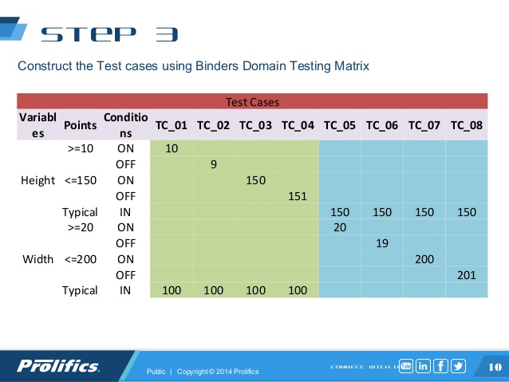

# Software Testing MOOC

This repository contains the code examples and exercises of
TU Delft's edX MOOC on Software Testing.

## License

This repository is licensed under CC BY-NC-SA.

<hr>

# Course Content

## Automated Software Testing
- Introduction to JUnit
- `Defect` (aka `Bug`) vs. `Failure`: Defect **can** lead to a Failure 

## Functional Testing

### Equivalence Partitioning (aka: Equivalence Classes) 

**Samples:** 

a) The [Leap Year Calculation](./src/main/java/tudelft/leapyear/LeapYear.java) has to respect 4 cases (==partitions):
- non leap year (%4!==0)
- non leap centurial year (%100==0 AND %400!=0)
- leap centurial year (%400==0)
- leap year (%4==0 AND %100!=0)

It's called `equivalence` partitions, as for each partition you can use any input, which fulfills the partitions 
condition, e.g. for 'non leap year' you can take year = 2001, year=2002, year = 2003, year = 2005...

b) Christmas Discount on raw Amount

- category 1: Christmas | not Christmas
- category 2: amount > 0 | amount == 0 | amount < 0 (exception!)  

Combinatorial:
=> 2x3 Cases = 6 Cases
   for amount < 0, 1 case is enough => 5 Cases

### Boundary Testing/Boundary Analysis

Sample:
`If the total ordering is above 100, shipping costs are $5.`

==> 
```
   OUT-points                          | IN-points
                      ...   98 99 100  | 101 ...
                                  ON-  | OFF-point
```

**Domain Matrix**



### CORRECT

The **CORRECT** way stands for Conformance, Ordering, Range, Reference, Existence, Cardinality, and Time:

- **Conformance**: 
  Many inputs should conform to a specific format. For example, an e-mail address has a name@domain format. 
  What happens to our system if the e-mail is invalid, e.g, no name, or no domain, or invalid domain?
- **Ordering**: 
  The input and output may depend on some ordering criteria. For example, our system expects the user to input 
  all invoices for reimbursement in the chronological order they happened. 
  What happens if the user makes a mistake and does not send it in the right order? 
  Or, our system may need to return the list of best players, according to the number of points they made in 
  the last game, from the best to the worst. Does the system return in the right order? 
- **Range**: 
  The inputs should be within a defined limit. For example, the user needs to input her age. 
  What happens if she passes a negative number? What happens if she passes 200? 
- **Reference**: 
  The inputs and behaviour under test may require a previous state. For example, in a web store, 
  for an order to be placed, the user needs to have an account first. 
  What happens if the user tried to place an order without an account?
- **Existence**: 
  The inputs "may not exist". What happens if someone passes a null or an empty string?
- **Cardinality**: 
  The famous off-by-one error. It happens when we forget to "iterate the last item" in our algorithm. 
  For example, if you should return the number of elements between m and n (inclusive), 
  the intuitive answer would be (n-m), whereas the right answer is (n-m+1). 
  In practice, this often happens in iterative loops: developers often iterate one time too few. 
  You can read about the fencepost error in the Wikipedia. 
  As a tip, what happens to your system when it has zero, one, or many values to iterate?
- **Time**: 
  Your input may be about date/time. What happens to your system if the input was done by a person in a place 
  that does not have Daylight Saving Time? 
  Does the system work for someone in New York (GMT-5) as well as for someone in Amsterdam (GMT+1)?
